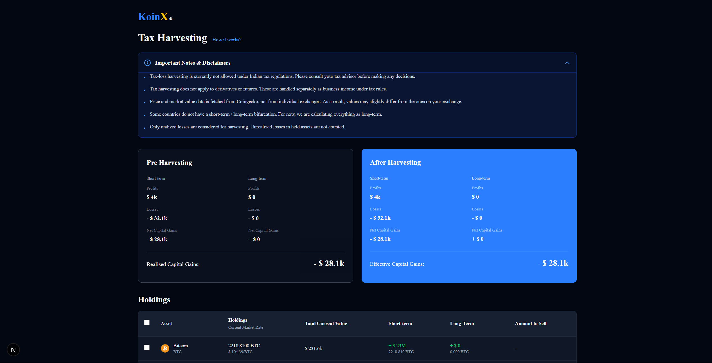
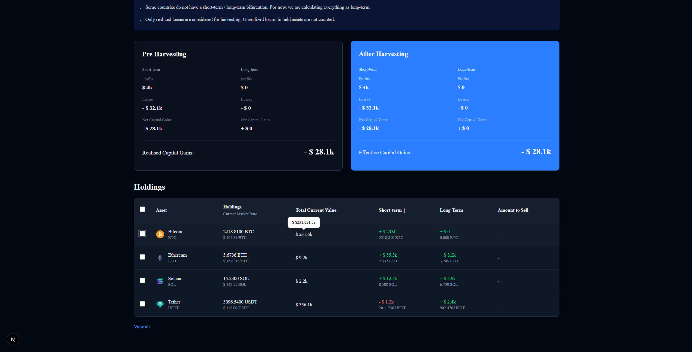

# Koinx Tax Harvesting Calculator

A modern web application for cryptocurrency traders to calculate and optimize capital gains/losses through tax harvesting strategies. Built with Next.js, React, TypeScript, and Tailwind CSS.

## Overview

The Koinx Tax Harvesting Calculator is an interactive tool that helps cryptocurrency investors:

- **Track Holdings**: Monitor your cryptocurrency portfolio with real-time prices and holdings information
- **Calculate Capital Gains**: View both Short-Term Capital Gains (STCG) and Long-Term Capital Gains (LTCG)
- **Tax Harvesting**: Select specific holdings to simulate capital gains optimization strategies
- **Tax Savings**: Calculate potential tax savings from strategic asset selection
- **Responsive Design**: Works seamlessly across desktop and mobile devices
- **Dark/Light Theme**: Built-in theme support for user preference

## Features

✨ **Key Features:**

- 📊 Interactive portfolio dashboard with cryptocurrency holdings
- 💰 Real-time capital gains/losses calculations (STCG & LTCG)
- ✅ Multi-select holdings for tax harvesting simulation
- 🎯 Dynamic tax savings estimation
- 📈 Sortable holdings table
- 🌓 Dark/Light theme support
- 🎨 Beautiful UI with shadcn/ui components
- ♿ Accessible component library with Radix UI
- 📱 Mobile-responsive design
- 🚀 Fast performance with Next.js App Router

## Setup Instructions

### Prerequisites

- **Node.js**: Version 18.0 or higher
- **pnpm**: Version 8.0 or higher (recommended) or npm/yarn

### Installation

1. **Clone the repository** (if applicable):
   ```bash
   git clone <repository-url>
   cd koinx-assignment
   ```

2. **Install dependencies**:
   ```bash
   pnpm install
   ```
   
   Or with npm:
   ```bash
   npm install
   ```

3. **Run the development server**:
   ```bash
   pnpm dev
   ```
   
   Or with npm:
   ```bash
   npm run dev
   ```

4. **Open in browser**:
   - Navigate to [http://localhost:3000](http://localhost:3000)
   - The application will automatically reload when you make changes

### Available Scripts

```bash
# Development server with hot reload
pnpm dev

# Build for production
pnpm build

# Start production server
pnpm start

# Run ESLint for code quality
pnpm lint
```

### Build & Deployment

To build for production:

```bash
pnpm build
pnpm start
```

The application is optimized for deployment on platforms like:
- **Vercel** (recommended for Next.js)
- **AWS** (with appropriate configuration)
- **Docker** (with containerization)
- **Other Node.js hosting platforms**

## Project Structure

```
src/
├── app/
│   ├── layout.tsx          # Root layout with theme provider
│   ├── page.tsx            # Main tax harvesting page
│   └── globals.css         # Global styles
├── components/
│   ├── TaxHarvestingCard.tsx      # Capital gains display card
│   ├── DisclaimerSection.tsx      # Legal disclaimer
│   ├── CurrencyValue.tsx          # Currency formatting component
│   ├── Tooltip.tsx                # Tooltip component
│   ├── theme-provider.tsx         # Next.js theme provider
│   └── ui/                        # shadcn/ui component library
├── hooks/
│   └── use-mobile.ts              # Mobile detection hook
├── lib/
│   └── utils.ts                   # Utility functions
└── utils/
    └── formatCurrency.ts          # Currency formatting utilities
```

## Screenshots

### Main Dashboard

- Portfolio overview with cryptocurrency holdings
- Display of current prices, total holdings, and average buy prices
- Real-time STCG and LTCG calculations
- Interactive checkboxes for tax harvesting selection

### Holdings Table

- Sortable columns for STCG and LTCG
- Coin logos and names
- Current price and total value display
- Profit/loss indicators

### Main Dashboard (Mobile View)
.png)
.png)

*Note: Actual screenshot images can be added to the repository's `/public/screenshots` folder and referenced here.*

## Assumptions

### Data & Calculations

1. **Mock Data**: The application currently uses mock cryptocurrency data. In production, this would be replaced with:
   - Real-time price feeds (e.g., CoinGecko API, Binance API)
   - User-provided portfolio data from connected wallets or uploaded files
   - Historical transaction data for accurate cost basis calculations

2. **Capital Gains Calculation**:
   - STCG applies to assets held for ≤ 1 year
   - LTCG applies to assets held for > 1 year
   - Calculations assume standard tax jurisdictions (e.g., US tax law)
   - Tax rates are not applied in the current version; the app shows gains/losses amounts

3. **Currency Display**:
   - All values are displayed in USD by default
   - The application assumes USD as the base currency for calculations
   - Multi-currency support can be added based on requirements

### User Interaction

4. **Tax Harvesting Strategy**:
   - Selecting holdings simulates selling those assets for tax optimization
   - The calculation aggregates selected holdings' gains/losses
   - No actual transactions occur; this is purely a planning tool

5. **Theme Support**:
   - The application auto-detects system theme preference
   - Users can manually switch between light and dark themes
   - Theme preference is persisted in local storage

### Technical Assumptions

6. **Browser Compatibility**:
   - Targets modern browsers (Chrome, Firefox, Safari, Edge)
   - Requires JavaScript to be enabled
   - Uses CSS Grid and Flexbox for responsive design

7. **Performance**:
   - Assumes sufficient client-side processing power
   - Data sets are limited to ~10 holdings for optimal performance
   - Larger portfolios may require pagination or virtualization

8. **Security**:
   - The application is client-side only; no sensitive data is sent to servers
   - User data is not persisted unless manually exported
   - In production, implement authentication and data encryption

9. **Accessibility**:
   - Follows WCAG 2.1 Level AA standards
   - Uses semantic HTML and ARIA attributes
   - Keyboard navigation is fully supported

## Technologies Used

- **Frontend Framework**: Next.js 16.2.6
- **React Version**: 19.2.4
- **Language**: TypeScript 5
- **Styling**: Tailwind CSS 4 with PostCSS
- **Component Library**: shadcn/ui with Radix UI
- **Charts**: Recharts 3.8.0
- **Date Handling**: date-fns 4.3.0
- **Theme Management**: next-themes
- **UI Animations**: tailwind-css animations, Vaul transitions
- **Icons**: lucide-react 1.17.0
- **Package Manager**: pnpm

## Configuration

### Environment Variables

Currently, no environment variables are required for the development setup. For production deployments, consider adding:

```bash
# .env.local
NEXT_PUBLIC_API_URL=your_api_endpoint
NEXT_PUBLIC_ANALYTICS_ID=your_analytics_id
```

### Customization

- **Colors**: Edit `src/app/globals.css` or Tailwind config
- **Fonts**: Modify `src/app/layout.tsx`
- **Theme**: Configure `src/components/theme-provider.tsx`
- **Data**: Update mock data in `src/app/page.tsx`

## Development Tips

1. **Hot Module Replacement**: Changes to component files automatically refresh the browser
2. **Type Safety**: Full TypeScript support for compile-time type checking
3. **ESLint**: Run `pnpm lint` to check code quality
4. **React DevTools**: Use React DevTools browser extension for debugging

## Future Enhancements

- 🔗 Wallet integration (MetaMask, WalletConnect)
- 📤 CSV/Excel import for portfolio data
- 💾 Backend API integration for persistent data storage
- 🔔 Tax deadline reminders and notifications
- 📊 Advanced reporting and tax forms (Form 8949)
- 🌍 Multi-currency support
- 📱 Mobile app version
- 🤖 AI-powered tax optimization recommendations

## Support & Documentation

- [Next.js Documentation](https://nextjs.org/docs)
- [React Documentation](https://react.dev)
- [Tailwind CSS Documentation](https://tailwindcss.com/docs)
- [shadcn/ui Components](https://ui.shadcn.com)
- [TypeScript Documentation](https://www.typescriptlang.org/docs)

## License

This project is part of the Koinx assignment. Please refer to your assignment requirements for licensing details.

## Notes

- This is a frontend-only application suitable for portfolio planning
- All calculations are performed client-side
- Data is not persisted between sessions
- For production use, integrate with proper backend services and APIs
- Ensure compliance with local tax regulations and requirements

---

**Last Updated**: May 2026
